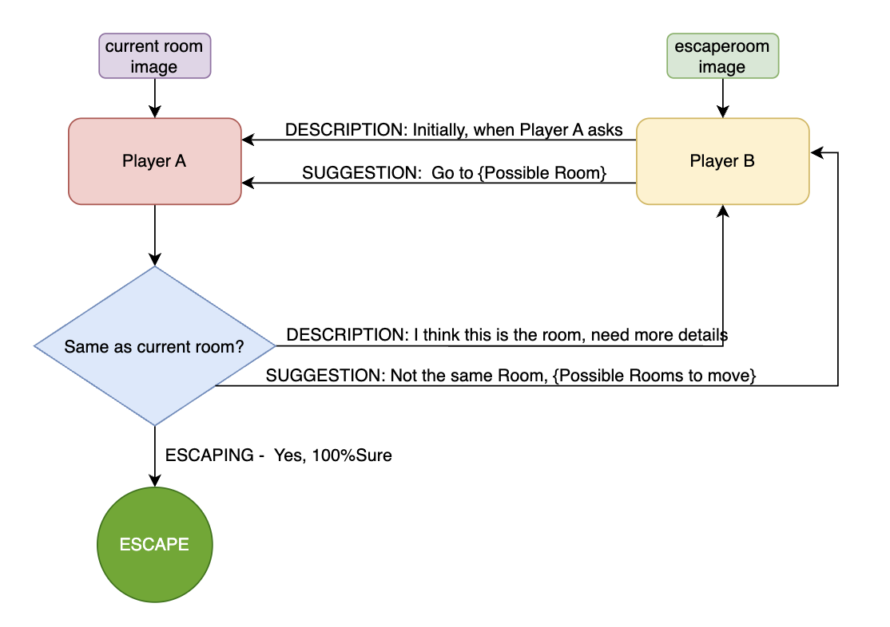

# ESCAPE ROOM

## Introduction

#### Scenario
Assume an Agent, let's say Hunt, has been captured by the enemies and is held as hostage. The Agent somehow managed to get out of the shackles, you know cause he's Hunt, and managed to get hold of a Mobile Telephone and called up his buddy, lets say Benji. Together, their mission is to make Hunt reach a Room, from where he can easily escape. Hunt can only provide possible moves (to a neighboring room), or the description of the current room he is in. Benji, on the other hand, somehow knows which Room Hunt needs to reach in order to escape (Major plot hole, but its happening anyway). Benji can suggest a possible move, or if Hunt asks for more detailed description, then provide a more detailed description of the Escape Room. The Mission is done when Hunt successfully reaches the Escape Room

#### Game Details
Escape Room is a multimodal collaborative game between two agents based on the Mapworld Environment. Here, one agent Hunt is stuck inside the mapworld, who can explore the world but has limited observability (i.e. can only observe the current room and possible exits at each time step) (Can add large enough memory part #TODO). There's another agent, Benji outside the mapworld, with no observability and cannot explore the world. Benji has been given only an Image of an Escape Room. Hunt needs to reach this escape room to win the Game. Hunt and Agent B can only communicate with each other via a text channel

As shown in the below figure, Game starts with B sending the description of the Escape Room. A checks if its the same room, If he's sure, he can say the tag "ESCAPING" and the game ends there. If he's not sure, he can ask for more deatils starting with tag "DESCRIPTION:". Then, B needs to provide it, by using the same tag "DESCRIPTION:" in a greater depth, or include minor details (Useful only in Ambiguous cases). If A is definitely sure that this is not the room, he can discuss it with B and ask for move suggestions using "SUGGESTION:" as a tag, a B can suggest a move to A

